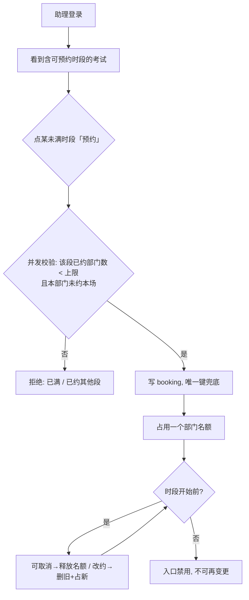
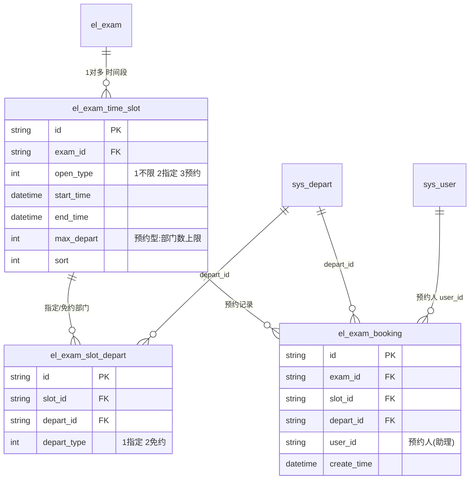
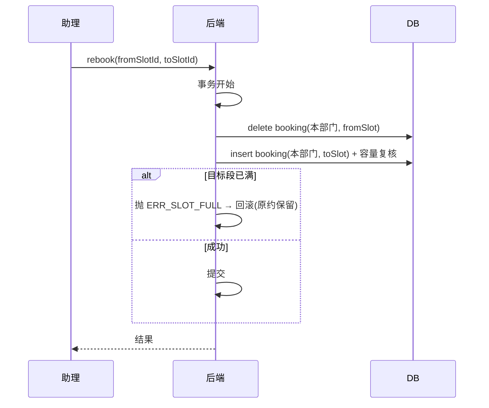

# Design 001 · 考试助理与预约考试

## Summary

把考试的「开放方式 + 时间」从考试级下沉到新的**时间段**实体（不限人员 / 指定部门 / 预约考试三类）；新增 `assistant` 角色，由考试助理代表本部门（含下级）认领「预约考试」时段并占部门名额；应考资格在开考时点按部门树**动态判定**，不落名单快照。覆盖 PRD 001 的 R1–R19。

## Problem Frame

承接 PRD：季度考核今天由 `sa`/`teacher` 集中排期，部门多、作息各异时协调成本高。把「挑哪个时段考」下放给部门助理，管理员只开时段并设容量。现有 `el_exam` 用单一 `open_type` + 单一起止时间，无法承载「同一考试多时段、每段独立开放方式与窗口」——这是本特性结构性改动的来源。

## 概要设计

### 架构与模块
- **后端**（`exam-api`，SpringBoot + MyBatis-Plus + Shiro）
  - `modules/exam/`：新增 `ExamTimeSlot`、`ExamSlotDepart`、`ExamBooking` 的 entity/mapper/service；时段配置并入考试 `save` 链路；新增预约 `BookingController`。
  - `modules/exam/enums`：新增 `SlotOpenType`（1 不限人员 / 2 指定部门 / 3 预约考试）。
  - 复用：`sys_depart` 部门树、`sys_user.depart_id`、Shiro 角色体系、考试取卷/列表入口（接入动态资格判定）。
- **前端**（`exam-vue`，Vue2 + Element-UI）
  - 管理端 `views/exam/`：考试编辑页加「时间段」配置区 + 「查看预约」弹窗。
  - 助理端 `views/booking/`：新增「预约考试」列表页（`roles:['assistant']`）。
  - 系统配置页加「提前可见时长」。
- **外部依赖**：组织树（`sys_depart.dept_code` 层级编码）、Shiro `@RequiresRoles`、前端 `permission.js` 路由过滤。

### 核心业务流程（预约生命周期）



### 技术选型与关键决策
- **时间段独立建表**，不复用 `el_exam` 单值字段；`open_type`/起止时间下沉到段级。`el_exam` 旧字段保留以兼容历史，新考试以时段为准。
- **新增 `SlotOpenType` 枚举**，不复用考试级 `OpenType`——段级多了「预约」第三类且语义独立，复用会污染既有判定。
- **指定部门与免约部门共表** `el_exam_slot_depart`，以 `depart_type` 区分（1 指定可考 / 2 预约型免约）；二者都是「段→部门」多对多，合表减重复。
- **容量按「部门数」计**；`(exam_id, depart_id)` 唯一键强制 R7（每部门每场限一段）；改约 = 删旧 + 建新，受目标段容量约束。
- **资格动态判定，不落快照**；「部门子树」用 `sys_depart.dept_code` 前缀匹配（`LIKE '<前缀>%'`，单次查询），递归 `parent_id` 为备选。
- **`assistant` 接入现有 Shiro**；助理代表部门 = 其 `sys_user.depart_id`，无绑定表。

### 接口清单与契约

| 方法 | path | 鉴权 | 入参 | 出参 | 校验 / 新增错误码 | 覆盖 |
| --- | --- | --- | --- | --- | --- | --- |
| POST | `/exam/api/exam/save` | sa | exam + slots[] | success | 时段起止合法、预约型须 `max_depart≥1` | R1–R4d |
| GET | `/exam/api/booking/bookable` | assistant | `{ examId? }` | 含可约时段的考试列表 | 仅返回本部门可约的 | R5 |
| POST | `/exam/api/booking/book` | assistant | `{ slotId }` | success | 段未满、本部门未约本场、未到开始时刻 / `ERR_SLOT_FULL`、`ERR_DEPT_BOOKED`、`ERR_SLOT_STARTED` | R6–R9 |
| POST | `/exam/api/booking/cancel` | assistant | `{ slotId }` | success | 仅本部门、未到开始时刻 / `ERR_SLOT_STARTED` | R10 |
| POST | `/exam/api/booking/rebook` | assistant | `{ fromSlotId, toSlotId }` | success | 目标段未满、未开始 / 复用上面错误码 | R11 |
| GET | `/exam/api/exam/slot-bookings` | sa, teacher | `{ slotId }` | 已约部门 + 预约人 + 时间 | —— | R11b、R16、R19 |
| POST | `/exam/api/exam/slot-bookings/cancel` | sa, teacher | `{ slotId, departId }` | success（含 `needConfirm` 标志） | 已有试卷需二次确认 / `WARN_HAS_PAPER` | R17、R18 |

典型请求/返回示例：
```http
POST /exam/api/booking/book   { "slotId": "S001" }
200 { "code": 0, "msg": "预约成功" }
409 { "code": "ERR_SLOT_FULL", "msg": "该时段名额已满" }
```

### 前端设计
- **页面清单 + 路由**
  - `views/exam/form`（管理端，路由 `/exam/edit`，`sa`/`teacher`）——加「时间段」配置区 + 「查看预约」弹窗。
  - `views/booking/index`（助理端，路由 `/booking`，`roles:['assistant']`）——可约考试列表 + 预约/取消/改约。
  - `views/sys/config`——加「提前可见时长」字段。
- **页面间关系**：助理 `/booking` 列表 →（行内操作，无跳页）预约/取消/改约就地刷新；管理端 `/exam/edit` 时段表 →（点「查看预约」）弹窗 → 行内「取消」就地刷新。
- **每页调用接口**：`/booking` → `booking/bookable`、`book`、`cancel`、`rebook`；`/exam/edit` 弹窗 → `exam/slot-bookings`、`slot-bookings/cancel`。
- UI 以 `prototype/exam-form.html`、`assistant-booking.html`、`sys-config.html` 为基线。

### 权限设计（四级）
- **菜单权限**：助理端「预约考试」菜单仅 `assistant` 可见（`asyncRoutes` + `permission.js`）。
- **按钮权限**：管理端「查看预约 / 取消预约」按钮 `v-permission="['sa','teacher']"`；时段增删改仅 `sa`/`teacher`。
- **接口权限**：见上表 `@RequiresRoles`。
- **数据权限（行级可见域）**：助理所有预约接口的部门**强制取服务端 `sys_user.depart_id`**，不接受前端传部门——杜绝越权为他部门预约/取消。

  | 操作 | sa | teacher | assistant | student |
  | --- | --- | --- | --- | --- |
  | 配置时段 | ✓ | ✓ | ✗ | ✗ |
  | 预约/取消/改约（限本部门） | ✗ | ✗ | ✓ | ✗ |
  | 查看/管理员取消预约 | ✓ | ✓ | ✗ | ✗ |

### 非功能约束承接
- **并发（占名额）**：容量校验存在 check-then-act 竞态 → 详细设计用唯一键 + 事务兜底（见下）。
- **性能（部门树）**：动态资格判定与子树解析走 `dept_code` 前缀，单次查询，避免递归 N 次。
- **安全/权限**：助理部门服务端取，越权不可达；管理员取消放宽到 `sa`/`teacher`。

### 可观测与审计设计
- **关键日志**：预约/取消/改约打印 `slotId、departId、user_id、结果`；容量拒绝打印 `已约数/上限`。
- **审计**：管理员取消（R17/R18）属高风险干预，记录 `操作人、slotId、departId、是否已有试卷、时间`（PRD 把「取消审计」列为非目标，此处仅建议保留服务端日志，正式审计表留待后续 `/spec-change`）。
- 监控指标：暂无（系统无埋点设施，承接 PRD 非目标）。

### 风险与回滚
- **超卖**：并发占名额是头号风险 → 唯一键 + 事务（详见详细设计）。
- **历史兼容**：`el_exam` 旧 `open_type`/时间字段保留，旧考试路径不受影响；回滚即下线时段/预约入口，3 张新表可整体 DROP（见 migration 回滚段）。

## 数据 ER 模型


> **唯一约束**：`el_exam_booking (exam_id, depart_id)` 唯一（强制 R7）。
> **时间戳规约**：`el_exam_booking.create_time` 即预约时间（业务语义已含创建时间）；三张表均为操作型记录，无独立 `update_time` 需求（预约不"更新"，改约=删+建）——属豁免，注明在此。
> **字段长度规约**：本特性表全部为 ID（`varchar(64)`，系统生成）+ int + datetime，**无自由文本输入字段**，故无前后端字符数对齐项。`sys_config.advance_visible_minutes` 为 int。
> 物理建表与回滚见 `docs/ops/install/migration-2026-预约考试.sql`，与本 ER 逐字段一致。

---

> **检查点**：以上**概要设计 + ER 已锁定**（与既有 migration、plan 001 一致）。下面详细设计只展开 ER/概要推不出、且推错代价高的决策。

## 详细设计

> 右尺寸：只写下面这些**关键决策**。标准时段/预约的 CRUD、DTO 映射、列表分页、Element-UI 表单等能从概要 + 约定可靠生成的，**不在此预写**，留给 `ce-work` 生成后评审。

### 占名额并发与幂等（覆盖 R7、R8、R11）
- **依赖**：概要§接口清单 `booking/book`、ER §`el_exam_booking` 唯一键。
- **问题**：`count(已约部门) < max_depart` 是 check-then-act，两个助理并发可同时通过校验导致超卖。
- **设计**：
  1. 业务层先查 `count < max_depart` 做友好拦截（快路径，给"已满"提示）。
  2. **真正的兜底是唯一键 + 事务**：`(exam_id, depart_id)` 唯一键保证同部门不重复（R7）；容量最终一致性用「插入后复核」：`@Transactional` 内 `insert booking` → `select count for update`（或对 slot 行加锁）复核 `count ≤ max_depart`，超出则抛 `ERR_SLOT_FULL` 触发回滚。
  3. **改约（R11）= 同一事务内 delete 旧 booking + 走上面的占名额**，目标段满则整体回滚，原约不丢。
- **幂等**：重复点击「预约」由 `(exam_id, depart_id)` 唯一键天然幂等（第二次插入冲突 → 返回"已约"）。

### 应考资格动态判定（覆盖 R12–R15）
- **依赖**：概要§核心业务流程、ER §`el_exam_slot_depart`/`el_exam_booking`。
- **窗口**：可见窗口 `[start_time - advance_visible_minutes, end_time]`，可作答窗口 `[start_time, end_time]`。
- **判定**（取卷/列表时点实时算，不落快照）：
  - 不限人员 → 窗口内即可。
  - 指定部门 → 学员 `depart_id` ∈ 任一 `depart_type=1` 部门的**子树**。
  - 预约考试 → 学员 `depart_id` ∈（已 `booking` 的部门 ∪ `depart_type=2` 免约部门）的**子树**。
- **子树解析**：`sys_depart.dept_code LIKE '<目标 dept_code>%'`，一次查询拿全子树；学员部门是否落入用前缀包含判断。

### 管理员取消 + 二次确认（覆盖 R17、R18）
- **依赖**：概要§接口 `slot-bookings/cancel`。
- **设计**：取消前查「被取消部门（含下级）在本场是否已有试卷」；有 → 返回 `needConfirm=true` 让前端弹二次确认；确认后仅 `delete booking` 释放名额，**不删试卷/成绩**（资格动态判定 → 该部门之后开考自动失去资格，已交卷成绩天然保留）。管理员**不受**「时段开始前」限制。

### 改约时序（覆盖 R11）

