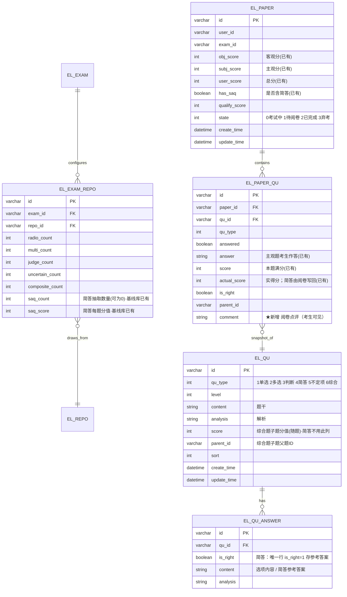

# 005 简答题与人工阅卷 · Design

## Summary

在既有 `qu` / `paper` / `exam` 模块上**接通原作者预留但未完成的主观题骨架**：新增简答题型（`qu_type=4`），复用 `el_qu`/`el_qu_answer` 承载简答（题干=content、解析=analysis、参考答案=单行 answer），简答分值在组卷按题型统一配置（复用基线库**已存在**的 `el_exam_repo.saq_count`/`saq_score`），交卷沿用已有 `has_saq → WAIT_OPT` 分支，新增**整份阅卷接口**逐题写回 `actual_score` 与点评、用既有 `sumSubjective` 合分后置 `FINISHED`。**数据层仅新增 1 列**（`el_paper_qu.comment` 点评），核心是补齐阅卷接口、组卷抽取与题型枚举。

## Problem Frame

承接 PRD 005：系统题型枚举无 type 4、`PaperController` 无阅卷接口、组卷不抽简答、`Paper.has_saq` 建卷时恒为 `false`，导致主观题链路断裂。但底层已具备：`Paper.obj_score/subj_score/user_score/has_saq`、`PaperQu.answer/actual_score`、`PaperState.WAIT_OPT`、`sumObjective(qu_type IN 1,2,3,5)`、`sumSubjective(qu_type=4)`、`handExam` 的 `has_saq` 分支、`fillAnswer` 的主观题「只标记已答不自动给分」分支、错题本对 `isRight=true` 主观题的天然排除。本设计在不改动综合题判分链（PRD 非目标）的前提下，把缺失的几处接通。

## 概要设计

- **架构与模块**：
  - 后端 `qu` 模块：题型枚举加 `SHORT_ANSWER=4`；录题校验扩展（简答需参考答案+分值、无选项）。
  - 后端 `exam` 模块：`ExamRepo` 加 `saq_count`（组卷简答数量，可为 0）；`review-paging` 鉴权放开到 teacher。
  - 后端 `paper` 模块（**核心**）：`generateByRepo` 增简答抽取分支并令 `savePaper` 据实置 `has_saq`；新增**阅卷接口** `/paper/review`（提交打分+点评、合分、置完成）与**阅卷详情** `/paper/review-detail`（加载一份待阅卷试卷的简答题供打分）。
  - 前端：录题表单（简答字段）、组卷（简答数量）、答题（简答文本框）、待阅卷列表与**阅卷页**、学员成绩详情（简答得分+参考答案+点评）。UI 基线见 `docs/engineering/prototype/`（`qu-form.html`、`exam-form.html`、`exam-taking.html`、`exam-papers.html`、`paper-grade.html`、`exam-result.html`）。

- **核心业务流程**：

  ```mermaid
  flowchart TD
      A[考生交卷 handExam] --> B[sumObjective 客观分]
      B --> C{has_saq?}
      C -- 否 纯客观 --> D[state=FINISHED·joinResult·即时出分]
      C -- 是 含简答 --> E[state=WAIT_OPT·subj_score=0·总分暂不出]
      E --> F[sa/teacher 在待阅卷列表打开阅卷页]
      F --> G[逐题录入 0..满分 整数得分 + 可选点评]
      G --> H{每题得分均合法?}
      H -- 否 --> G
      H -- 是 提交 /paper/review --> I[写回 actual_score+comment]
      I --> J[subj_score=sumSubjective·user_score=obj+subj]
      J --> K[state=FINISHED·joinResult 判定通过]
      K --> L[考生即时可见总分/逐题/参考答案/点评]
  ```

- **技术选型与关键决策**：
  1. **题型编码沿用 004 约定 `4=主观/简答`**（迁移脚本已注明「4主观」、`sumObjective/sumSubjective` 已按此口径写好）。仅在 `QuType` 加常量，无 DDL。
  2. **简答复用 `el_qu`/`el_qu_answer`，不加题目侧新列**：题干→`el_qu.content`、解析→`el_qu.analysis`、**参考答案→单行 `el_qu_answer`（`is_right=1`，`content`=参考答案文本）**；简答不在题目侧存分值。复用既有 `savePaperQu` 的答案拷贝与 `findQuDetail/paperResult` 的 `answerList` 加载链路，前端按 `qu_type=4` 渲染为「参考答案」而非选项。备选（独立 `el_qu.reference_answer` 列）更显式但需新列与特殊加载，权衡后取复用。
  3. **简答分值组卷统一配置（复用已存在列）**：与单选/多选一致——基线库 `el_exam_repo` **已有** `saq_count`/`saq_score` 两列（本特性无需为组卷加列，仅给 `ExamRepo` 实体补 `saqCount`/`saqScore` 字段映射）；抽中简答的满分取 `repo.saqScore`。区别于综合题（分值随子题）。
  4. **整份阅卷、阅完即合分置完成**：不引入独立「发布成绩」状态；阅卷提交即 `FINISHED` + `joinResult`，考生即时可见。
  5. **阅卷仅作用于 `WAIT_OPT` 试卷、且不支持二次改分**（PRD 非目标）：接口前置校验状态，`FINISHED` 卷拒绝再阅，天然实现「成绩公开后不改分」。

- **接口清单与契约**：

  | 方法 | path | 鉴权 | 入参 | 出参 | 新增错误码 | 覆盖 |
  | --- | --- | --- | --- | --- | --- | --- |
  | POST | /exam/api/qu/qu/save | sa,teacher | QuSaveReqDTO（简答含 referenceAnswer，无 options、无 score） | ok | ERR_QU_SAQ_INVALID | R1,R2 |
  | POST | /exam/api/exam/exam/review-paging | sa,teacher（**放开 teacher**） | PagingReqDTO\<ExamDTO\> | IPage\<ExamReviewRespDTO\> | — | R5,R11 |
  | POST | /exam/api/paper/paper/review-detail | sa,teacher | {paperId} | PaperReviewRespDTO（试卷头 + 简答题列表：题干/考生作答/参考答案/解析/满分/已评分/点评） | ERR_PAPER_NOT_WAIT | R7 |
  | POST | /exam/api/paper/paper/review | sa,teacher | PaperReviewReqDTO{paperId, items:[{quId,score,comment}]} | ok | ERR_PAPER_NOT_WAIT、ERR_SCORE_RANGE | R7,R8,R9,R10 |

  - **字段校验（字符数为唯一真值，前端 `maxLength`＝后端校验＝DB `varchar` 字符数）**：见 ER 字段长度表。简答得分 `score` 为整数且 `0 ≤ score ≤ 该题满分`；提交时所有简答题必须均已评分（无遗漏）。
  - **分页约定**：沿用 `PagingReqDTO<T>` / `IPage<T>`。
  - **新增错误码（paper/qu 域续编，最终取值以 `ApiError` 枚举为准，plan 落定不重排）**：
    - `ERROR_PAPER_NOT_WAIT`「试卷不是待阅卷状态，无法阅卷」
    - `ERROR_SCORE_RANGE`「简答题得分须为 0~该题满分的整数，且不得漏评」
    - `ERROR_QU_SAQ_INVALID`「简答题须填写参考答案与分值」

  典型请求/返回示例：
  ```http
  POST /exam/api/paper/paper/review
  { "paperId":"P1", "items":[ {"quId":"Q6","score":12,"comment":"要点齐全…"},
                              {"quId":"Q7","score":9,"comment":"漏两点…"} ] }
  200 { "code":0, "msg":"ok" }
  // 失败：{ "code":ERROR_SCORE_RANGE, "msg":"简答题得分须为 0~该题满分的整数，且不得漏评" }
  ```

- **前端设计**：
  - 页面/路由（沿用既有 `exam-vue` 路由风格）：录题 `qu-form`（简答字段）、组卷 `exam-form`（简答数量）、答题 `exam-taking`（简答文本框）、待阅卷列表 `exam-papers`（状态列+「阅卷」）、**阅卷页 `paper-grade`（新）**、学员成绩详情 `exam-result`/`my-records`。
  - 页面间数据流：`exam-papers`（state=WAIT_OPT 行）→（带 paperId）→ `paper-grade`；`paper-grade` 提交成功 → 回 `exam-papers`；学员 `my-records`（待阅卷态无分）→ 阅卷后 → `exam-result`（含简答得分/参考答案/点评）。
  - 每页调用接口：`paper-grade` 调 `review-detail`（加载）+ `review`（提交）；`exam-papers` 调 `paper/paging`（按 state 过滤待阅卷）；`exam-form` 的组卷读写 `ExamRepo`（含 saq_count）；`exam-result` 调 `paper-result`（含简答 actual_score/comment/参考答案）。

- **权限设计（四级）**：
  - 菜单/按钮权限：阅卷入口（待阅卷列表、阅卷页）仅对 `sa`/`teacher` 渲染；考生端无任何阅卷入口（R11）。
  - 接口权限矩阵：

    | 接口/操作 | sa | teacher | assistant | student |
    | --- | --- | --- | --- | --- |
    | 简答录题 /qu/save | ✓ | ✓ | ✗ | ✗ |
    | 待阅卷列表 /review-paging | ✓ | ✓ | ✗ | ✗ |
    | 阅卷详情 /review-detail | ✓ | ✓ | ✗ | ✗ |
    | 提交阅卷 /review | ✓ | ✓ | ✗ | ✗ |
    | 我的成绩 /paper-result | 本人 | — | — | ✓本人 |

  - 数据权限（行级）：本期 `sa`/`teacher` 可阅**全部**待阅卷试卷（PRD 非目标：不按考试归属隔离），无行级过滤。

- **非功能约束承接**：
  - 兼容性 → 不改综合题/不定项判分；`sumObjective` 口径 `IN(1,2,3,5)` 已排除简答(4)，无需变更；纯客观卷 `handExam` 分支不变。
  - 判分一致性 → 总分 `user_score = obj_score + subj_score`，`subj_score=sumSubjective` 对 `actual_score` 求和（确定性）；阅卷仅写简答 `actual_score`，不触客观题。
  - 字段长度全链路一致 → 见 ER 字段长度表，前端 `maxLength`＝后端校验＝DB 字符数。
  - 权限 → 上述矩阵；写操作 `@Transactional(rollbackFor=Exception.class)`，事务内不做 RPC/IO。
  - 数据库变更 → 落 `docs/ops/install/migration-2026-subjective-grading.sql`，与本 ER 逐字段一致、幂等、含回滚段。

- **可观测与审计设计**：阅卷提交记录 SLF4J 占位符日志（paperId、阅卷人、各题得分、耗时；点评文本不全量入日志）；`update_time` 反映阅卷时刻，可追溯「谁何时完成阅卷」（阅卷人 ID 是否落库见待解决）。

- **风险与回滚**：
  - 并发：同一待阅卷试卷被两名阅卷人同时提交 → 以「状态前置校验 + 仅 `WAIT_OPT→FINISHED` 单向流转」兜底，第二次提交因状态非 `WAIT_OPT` 被 `ERROR_PAPER_NOT_WAIT` 拒绝（详见详细设计 §并发与幂等）。
  - 数据前置：经核验，`el_paper.obj_score/subj_score/has_saq/user_score` 与 `el_exam_repo.saq_count/saq_score` 均已在基线库 `数据库脚本.sql` 中存在，本特性不重复添加；仅需补 `el_paper_qu.comment`。
  - 回滚：migration 提供 DROP `comment` 的回滚段（唯一新增列）。

## 数据 ER 模型



> ER 为逻辑视图，是 `/spec-plan` 物理 migration 的唯一逻辑来源，二者逐字段一致。本特性**仅新增 1 列**：`el_paper_qu.comment`（点评）。其余字段——`el_exam_repo.saq_count`/`saq_score`、`el_paper.has_saq/obj_score/subj_score/user_score`、`el_paper_qu.answer/actual_score`、`el_qu.content/analysis`——均**已存在于基线库** `数据库脚本.sql`，简答复用、不新增（实体侧需补 `ExamRepo.saqCount`/`saqScore` 字段映射）。
>
> **时间戳**：`EL_EXAM_REPO`/`EL_PAPER_QU`/`EL_QU_ANSWER` 为关联/快照/明细表，沿用各自现状（不强制补时间戳，与既有表一致）；业务主表 `EL_QU`/`EL_PAPER` 已有 `create_time`/`update_time`。
>
> **字段长度（字符数为唯一真值，前端 `maxLength`＝后端校验＝DB `varchar` 字符数）**：
>
> | 字段 | 类型 | 最大字符数 | 内容类型 | 说明 |
> | --- | --- | --- | --- | --- |
> | el_qu.content（简答题干） | varchar/text | 沿用现有题干上限（plan 核定，建议 ≤500） | 中文/符号 | 与其他题型题干同口径 |
> | el_qu_answer.content（参考答案） | varchar/text | 建议 ≤1000 | 中文/符号 | 参考答案文本 |
> | el_qu.analysis（解析） | varchar/text | 沿用现有解析上限 | 中文/符号 | 与其他题型同口径 |
> | el_paper_qu.comment（点评） | varchar | 建议 200 | 中文/符号 | 阅卷点评，考生可见 |
>
> 具体上限在 plan 与原型 `maxLength` 对齐定稿；超长字段若建索引注意 utf8mb4 前缀字节上限（本特性这些字段不建索引）。

## 详细设计

### 1. 题型枚举与简答录题（覆盖 R1、R2）
- **依赖**：概要§架构-qu、ER§EL_QU/EL_QU_ANSWER。
- **改动**：`QuType` 增 `Integer SHORT_ANSWER = 4`（Javadoc：简答题/主观题，人工阅卷）。
- **录题校验（QuServiceImpl.save 扩展）**：当 `qu_type=4`：必须有参考答案文本，**不接收选项、不在题目侧配分值**（分值在组卷 `saq_score`）；保存时将参考答案写为单行 `el_qu_answer`（`is_right=1`）。校验不过抛 `ERROR_QU_SAQ_INVALID`。其余题型分支不变。
- **代码落点**：`qu/enums/QuType.java`、`qu/service/impl/QuServiceImpl.java`、`ApiError` 新增 `ERROR_QU_SAQ_INVALID`。CRUD/DTO 映射等样板留给实现，不在此展开。

### 2. 组卷抽取简答 + 置 has_saq（覆盖 R3、R5、R6）
- **依赖**：概要§架构-exam/paper、ER§EL_EXAM_REPO/EL_PAPER。
- **接口签名**：无新接口；给 `ExamRepo` 实体补 `saqCount`/`saqScore` 字段映射（DB 列已存在）、组卷读写 DTO 透传，扩展组卷内部方法。
- **核心逻辑**：
  - `generateByRepo` 增分支：`if (saqCount>0)` 按 `QuType.SHORT_ANSWER` 随机抽 `saqCount` 道；`processPaperQu` 对简答 `setScore(repo.getSaqScore())`（与单选/多选同模式，组卷统一配分）。
  - `savePaper`：把 `paper.setHasSaq(false)` 改为**据实判定**——`quList` 含任一 `qu_type=4` 则 `true`。`total_score` 现有逻辑（累加非综合父行 `pq.score`）已自然含简答满分，无需改。
  - 交卷 `handExam` **不改**：已有 `has_saq → WAIT_OPT(subj_score=0)`、否则 `FINISHED+joinResult` 分支，纯客观/纯简答/混合三态均正确（纯简答时 `sumObjective=0`、`has_saq=true` 走待阅卷）。
- **代码落点**：`exam/entity/ExamRepo.java`、`exam` 组卷 DTO、`paper/service/impl/PaperServiceImpl.java`（`generateByRepo`/`processPaperQu`/`savePaper`）。

### 3. 整份阅卷接口（覆盖 R7、R8、R9、R10）
- **依赖**：概要§接口清单、ER§EL_PAPER/EL_PAPER_QU、详细§2。
- **接口签名**：
  - `PaperReviewRespDTO reviewDetail(String paperId)`：仅 `WAIT_OPT` 可加载，否则 `ERROR_PAPER_NOT_WAIT`；返回试卷头 + 简答题列表（题干、考生作答 `answer`、参考答案（取 answerList 唯一行）、解析、满分 `score`、已评分 `actual_score`、点评 `comment`）。
  - `void review(PaperReviewReqDTO req)`：阅卷提交。
- **核心逻辑（review，状态机 + 判定规则）**：
  1. 取 `paper`，**前置校验 `state==WAIT_OPT`**，否则 `ERROR_PAPER_NOT_WAIT`。
  2. 取本卷全部简答题（`qu_type=4`）。逐 `item` 校验：`quId` 属于本卷简答题、`score` 为整数且 `0≤score≤该题 score(满分)`、所有简答题均在提交集合中（**无漏评**）；任一不满足抛 `ERROR_SCORE_RANGE`（整体事务回滚）。
  3. 逐题 `update el_paper_qu set actual_score=#{score}, comment=#{comment} where ...`。
  4. `subj=sumSubjective(paperId)`；`paper.subjScore=subj`；`paper.userScore=objScore+subj`；`paper.state=FINISHED`；`paper.updateTime=now`；`updateById`。
  5. `userExamService.joinResult(userId, examId, userScore, userScore>=qualifyScore)`（与 `handExam` 完成分支一致，对齐成绩汇总）。
- **并发与幂等**：两阅卷人并发提交同卷——步骤 1 的状态前置校验 + 步骤 4 的 `WAIT_OPT→FINISHED` 单向流转构成兜底：先提交者成功置 `FINISHED`；后提交者在步骤 1（或并发下步骤 4 的条件更新）发现非 `WAIT_OPT` 被拒。实现用**带状态条件的更新**（`update ... set state=FINISHED where id=? and state=WAIT_OPT`，校验影响行数=1）确保仅一次生效，避免重复 `joinResult`。同一阅卷人重复点击同理被状态拒绝（幂等于「已完成不可再阅」）。
- **代码落点**：`paper/controller/PaperController.java`（+`/review`、`/review-detail`，`@RequiresRoles(value={"sa","teacher"}, logical=OR)`）、`paper/service/impl/PaperServiceImpl.java`（+`review`/`reviewDetail`，`@Transactional`）、`paper/dto/request/PaperReviewReqDTO`、`paper/dto/response/PaperReviewRespDTO`、`ApiError` 续编 `ERROR_PAPER_NOT_WAIT`/`ERROR_SCORE_RANGE`。`sumSubjective` 已存在，直接复用。
- **必要时序**：

  ```mermaid
  sequenceDiagram
      participant T as 阅卷人(sa/teacher)
      participant C as PaperController
      participant S as PaperService
      participant DB as el_paper(_qu)
      T->>C: POST /review {paperId, items}
      C->>S: review(req)
      S->>DB: select paper (校验 state=WAIT_OPT)
      alt 非待阅卷
          S-->>C: ERROR_PAPER_NOT_WAIT
      else 待阅卷
          S->>S: 校验每题 0..满分、无漏评
          S->>DB: update paper_qu set actual_score,comment
          S->>DB: subj=sumSubjective; update paper(state=FINISHED where state=WAIT_OPT)
          S->>S: joinResult(判定通过)
          S-->>C: ok
      end
  ```

### 4. 待阅卷列表与权限放开（覆盖 R5、R11）
- **依赖**：概要§权限、ER§EL_PAPER。
- **改动**：
  - `ExamController.review-paging` 鉴权由 `@RequiresRoles("sa")` 改为 `@RequiresRoles(value={"sa","teacher"}, logical=OR)`（考试维度待阅卷数已由 `ExamReviewRespDTO.unreadPaper` 提供）。
  - 某考试下「待阅卷试卷」列表复用 `paper/paging`，按 `state=WAIT_OPT` 过滤（`PaperListReqDTO` 已支持状态过滤则直接用；不支持则补一个状态入参）。
- **代码落点**：`exam/controller/ExamController.java`、`paper` 分页查询条件。

### 5. 学员成绩呈现（覆盖 R10）
- **依赖**：详细§3、ER§EL_PAPER_QU。
- **改动**：`paperResult`（`listForPaperResult`）的简答题项需带出 `actual_score`、`comment` 与参考答案（answerList 唯一行），供学员成绩详情展示「得分 + 参考答案 + 老师点评」。`FINISHED` 后即可见（阅完即可见，无独立发布）。`WAIT_OPT` 期成绩列表显示「待阅卷」、不出总分（前端按 state 渲染）。
- **代码落点**：`paper` 结果查询 DTO/Mapper（补 `comment` 列与参考答案），前端 `exam-result`/`my-records` 按 state 与题型渲染。

### 6. 考生作答简答（覆盖 R4）
- **依赖**：概要§架构-paper、ER§EL_PAPER_QU。
- **改动**：**复用既有 `PaperServiceImpl.fillAnswer` 的主观题分支，不改判分逻辑**——简答题（无选项）走 `fillAnswer` 现有 `else` 分支：保存考生作答 `answer`、`answered=（作答文本非空）`、`isRight=true`（使其不进错题本），`actual_score` 不在作答期写入（留待阅卷）。前端 `exam-taking` 简答题渲染为多行文本框，归入答题卡「简答题」分组、作答即标记已答。
- **验证点（对应 AE4）**：① 简答作答文本落库到 `el_paper_qu.answer`；② 清空作答后 `answered` 回 `false`；③ 简答不因 `isRight=true` 进错题本（回归既有行为）。
- **代码落点**：无后端改动（复用 `fillAnswer`）；前端 `exam-vue` 答题页扩展简答输入控件。此单元为「复用既有 + 前端扩展」，plan 拆 U 时据此承接。
