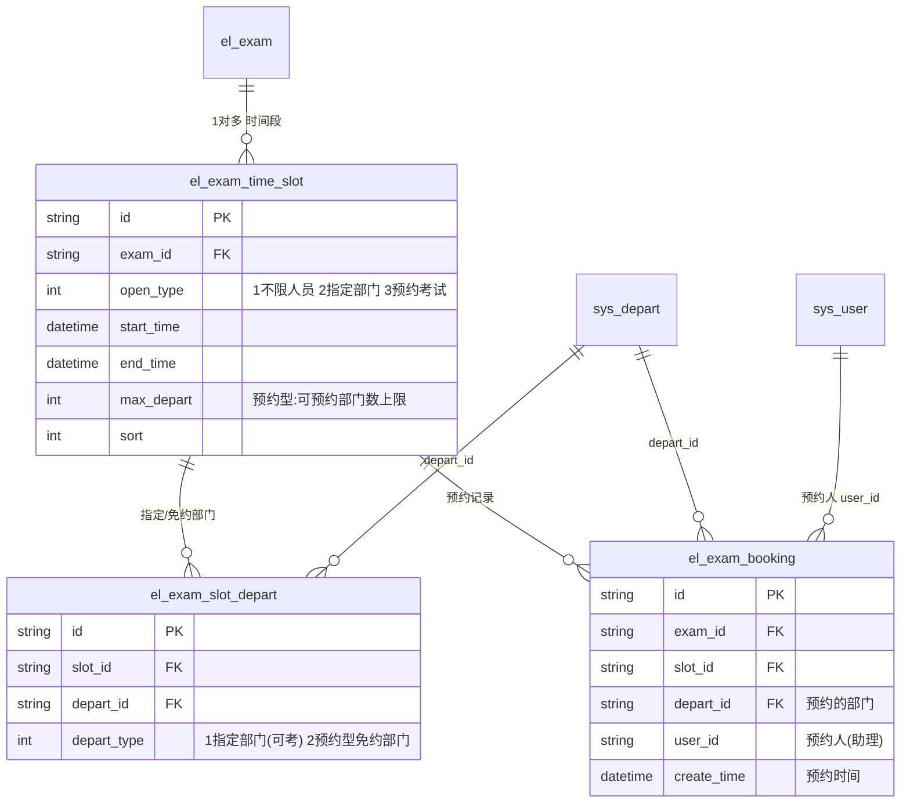
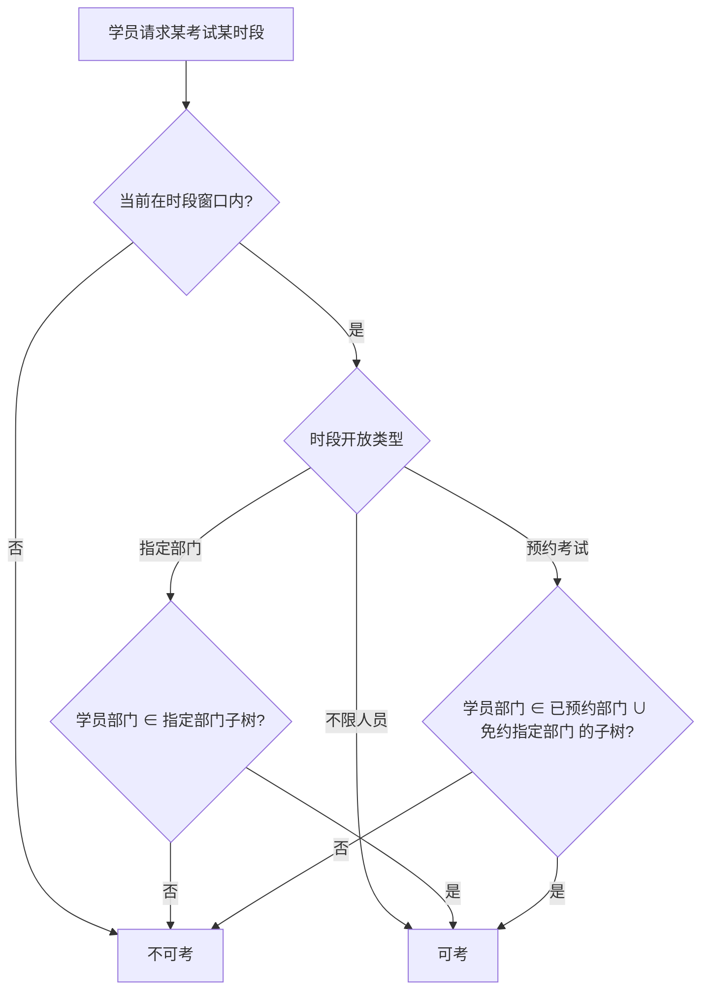

# feat: 考试助理与预约考试（全栈）

## Summary

在现有 `exam-api`（SpringBoot + MyBatis-Plus + Shiro）与 `exam-vue`（Vue2 + Element-UI）全栈系统中，新增「考试助理」角色与「预约考试」能力。核心是把考试的「开放方式 + 时间」从考试级下沉到新的**时间段**实体（不限人员 / 指定部门 / 预约考试三类），由考试助理代表本部门（含下级）认领预约型时段，应考资格在开考时按部门树动态判定。

---

## Problem Frame

详见 origin 文档 `docs/product/brainstorms/2026-05-29-exam-assistant-booking-requirements.md`。要点：企业季度考核今天由 `sa`/`teacher` 集中排期，部门多、作息各异时协调成本高。把"选哪个时段考"下放给部门自己的考试助理，管理员只开出可预约时段并设容量上限，各部门自助认领，去掉中心化排期的来回沟通，考试本身仍由 `sa`/`teacher` 掌控。

现有数据模型中，`el_exam` 用单一 `open_type`（1 公开 / 2 部门）+ 单一 `start_time`/`end_time` 表达开放方式与时间；定员/部门通过 `el_exam_depart` 关联。本特性要求同一考试存在**多个**时间段、每段独立的开放方式与窗口，现有单值字段无法承载——这是本计划主要的结构性改动来源。

---

## High-Level Technical Design

### 数据模型（新增三张表 + 一处配置）

`el_exam` 保留现有字段；新考试的开放方式与时间以时间段为准（见 KTD「open_type 过渡」）。`sys_config` 增加 `advance_visible_minutes`（提前可见时长，R4c）。

### 应考资格判定流程（开考/取卷时点动态计算，R12–R15）

「部门子树」= 目标部门及其所有下级（基于 `sys_depart`）。可见性窗口 = `[start_time - advance_visible_minutes, end_time]`；可作答窗口 = `[start_time, end_time]`。

---

## Key Technical Decisions

- **时间段独立建表，不复用 `el_exam` 单值字段。** 新增 `el_exam_time_slot`，把 `open_type` + 起止时间下沉到段级。这是 origin「时间段是独立实体」决策的落地（see origin）。`el_exam.open_type`/`start_time`/`end_time` 保留以兼容历史数据与未改造路径，新建考试不再依赖它们。

- **新增 `SlotOpenType` 枚举（1 不限人员 / 2 指定部门 / 3 预约考试），不复用 `core/enums/OpenType`。** 现有 `OpenType`（OPEN=1, DEPT_OPEN=2）语义是考试级开放方式，段级新增了"预约"第三类且语义独立，复用会污染既有判定。新枚举置于 `modules/exam/enums`。

- **指定部门与免约部门共用一张 `el_exam_slot_depart`，以 `depart_type` 区分。** R4b（指定部门时段的可考部门）与 R4d（预约型时段的免约部门）都是"段 → 部门"多对多，结构相同，合表减少重复。

- **容量按"部门数"计，唯一键防重复预约。** `el_exam_booking` 对 `(exam_id, depart_id)` 建唯一约束以强制 R7（每部门每场限一段）；容量校验为 `count(distinct depart by slot) < max_depart`（R8）。改约 = 删旧 + 建新，受目标段容量约束（R11）。

- **应考资格动态计算，不落参考名单快照。** 取卷/列表时实时按部门子树判定（R15）。需要一个"部门及所有下级"解析工具。

- **部门子树解析优先用 `dept_code` 前缀匹配。** `sys_depart.dept_code` 是层级编码（如 `A01A01A01`），子树 = `dept_code LIKE '<前缀>%'`，单次查询即可；递归 `parent_id` 为备选。具体实现待编码时定（见 Open Questions）。

- **`assistant` 角色接入现有 Shiro 角色体系。** 后端用 `@RequiresRoles("assistant")` 守卫预约接口；前端在 `asyncRoutes` 加 `roles: ['assistant']` 的路由组，复用现有 `permission.js` 过滤机制。助理代表部门 = 其 `sys_user.depart_id`（see origin），无需额外绑定表。

---

## Requirements

来源：origin 文档 R1–R15。按关注点分组。

### 时间段建模与配置（管理端）
- R1. 一场考试可配置一个或多个时间段，每段独立起止时间；考试不设总可考期。
- R2. 每段开放类型 ∈ {不限人员, 指定部门, 预约考试}。
- R3. 时间段增删改仅 `sa`/`teacher` 可做；助理不可改。
- R4. 预约型时段须设可预约部门数上限（正整数）。
- R4b. 指定部门型时段须以组织树勾选 ≥1 个可考部门（含下级）。
- R4c. 提供可配置「提前可见」时长（全局），窗口前该时长内可见考试。
- R4d. 预约型时段可选地指定若干"免预约部门"（含下级），无需预约即可考。

### 预约（考试助理）
- R5. 助理登录后可见含可供其部门预约的预约型时段的考试。
- R6. 助理只能为本部门预约，范围含该部门所有下级。
- R7. 一个部门同一场考试只能预约一个时段。
- R8. 预约占用一个部门名额；达上限后该段不可再被其他部门预约。
- R9. 预约截止于时段开始时刻；已开始不可再预约。
- R10. 时段开始前助理可取消本部门预约，释放名额。
- R11. 时段开始前助理可改约到同考试另一未满预约型时段。
- R11b. 预约记录保存预约人与预约时间；`sa`/`teacher` 可查看某段已预约部门及其预约人/时间。

### 应考资格（学员）
- R12. 预约型时段：学员属于（已预约部门 ∪ 免约指定部门，含下级）且在窗口内可考。
- R13. 指定部门型时段：学员属于被勾选部门（含下级）且在窗口内可考。
- R14. 不限人员型时段：窗口内任何人可考。
- R15. 资格在开考/取卷时点动态判定，随部门归属与窗口实时变化。

---

## Implementation Units

后端先行（数据与服务），前端随后（配置 UI、助理端、学员端），按依赖排序。

### U1. 数据库迁移与 `assistant` 角色种子

- **Goal**：建三张新表 + `sys_config.advance_visible_minutes` 列 + 种子 `assistant` 角色。
- **Requirements**：R1, R2, R4, R4b, R4c, R4d, R7, R11b 的存储基础。
- **Dependencies**：无。
- **Files**：新增 `docs/ops/install/migration-2026-预约考试.sql`（建表 `el_exam_time_slot` / `el_exam_slot_depart` / `el_exam_booking`，`(exam_id,depart_id)` 唯一键；`alter sys_config add advance_visible_minutes`；`insert sys_role('assistant','考试助理')`）。
- **Approach**：表结构对齐 HTD ERD；字段注释沿用现有 SQL 脚本风格（`数据库脚本.sql`）。ID 为 varchar(64) 雪花。
- **Patterns to follow**：`docs/ops/install/数据库脚本.sql` 既有建表/注释/索引风格。
- **Test scenarios**：`Test expectation: none -- DDL/seed 脚本，无行为逻辑；正确性由后续单元的服务测试间接覆盖。`
- **Verification**：脚本在 MySQL 5.7/8 可执行，表与唯一键、`assistant` 角色、配置列均创建成功。

### U2. 后端实体 / Mapper / DTO

- **Goal**：为三张新表建 MyBatis-Plus 实体、Mapper、DTO，以及 `SlotOpenType` 枚举。
- **Requirements**：R1, R2, R4, R4b, R4d, R11b。
- **Dependencies**：U1。
- **Files**：`exam-api/src/main/java/com/yf/exam/modules/exam/entity/ExamTimeSlot.java`、`ExamSlotDepart.java`、`ExamBooking.java`；对应 `mapper/*Mapper.java`；`dto/ExamTimeSlotDTO.java`、`dto/ExamBookingDTO.java`；`enums/SlotOpenType.java`。
- **Approach**：实体继承 `Model`，`@TableName` + `@TableId(ASSIGN_ID)`，镜像 `entity/Exam.java`、`entity/ExamRepo.java` 写法。
- **Patterns to follow**：`modules/exam/entity/Exam.java`、`modules/exam/entity/ExamRepo.java`、`modules/exam/mapper/ExamRepoMapper.java`。
- **Test scenarios**：`Test expectation: none -- 纯数据结构/映射；逻辑在 U3、U5、U6 测试。`
- **Verification**：MyBatis-Plus CRUD 基本读写通过（可借由后续服务测试验证）。

### U3. 考试保存/详情扩展（写入时间段与段-部门）

- **Goal**：扩展考试保存与详情，使一场考试可携带多个时间段、每段的指定/免约部门。
- **Requirements**：R1, R2, R3, R4, R4b, R4d。
- **Dependencies**：U2。
- **Files**：`exam-api/.../modules/exam/dto/request/ExamSaveReqDTO.java`（增加 `List<ExamTimeSlotDTO> timeSlots`，每段含 departIds）；`service/ExamService.java` + `service/impl/ExamServiceImpl.java`（`save`/`findDetail` 处理时间段与段-部门的级联增删改）；`controller/ExamController.java` 复用现有 `/save`、`/detail`（`@RequiresRoles("sa")`）。
- **Approach**：保存时按 `exam_id` 全量重写其时间段与段-部门（先删后插，参考 `ExamRepoServiceImpl` 处理组卷规则的级联方式）。校验：预约型须有 `max_depart>0`；指定部门型须 ≥1 部门。
- **Patterns to follow**：`modules/exam/service/impl/ExamServiceImpl.java`（现有 save 级联 `ExamRepo`/`ExamDepart` 的方式）。
- **Test scenarios**：
  - 保存含 3 段（每类型 1 段）→ 时间段与段-部门正确落库；再次保存删减一段 → 旧段与其段-部门被清除。
  - 预约型段 `max_depart` 缺失/≤0 → 保存报校验错。
  - 指定部门型段未选部门 → 保存报校验错。
  - `findDetail` 回读 → 时间段、段-部门、容量、窗口完整还原。
  - Covers AE 无（结构性，由 U5/U6 的 AE 覆盖应考与预约行为）。
- **Verification**：管理端创建/编辑考试后，详情接口回读结构与输入一致。

### U4. 部门子树解析工具

- **Goal**：提供"给定部门 → 该部门及所有下级部门 ID 集合"的解析能力，供资格判定与预约范围使用。
- **Requirements**：R6, R12, R13（含下级语义）。
- **Dependencies**：U1（依赖 `sys_depart` 现有结构，无新表）。
- **Files**：`exam-api/.../modules/sys/depart/service/SysDepartService.java`（新增 `listSelfAndChildren(departId)`）+ 其 impl。
- **Approach**：优先 `dept_code` 前缀匹配（`LIKE '<code>%'`）；若编码不可靠则回退递归 `parent_id`。返回含自身的部门 ID 列表。
- **Patterns to follow**：`modules/sys/depart` 既有 service 写法。
- **Test scenarios**：
  - 给定"技术部" → 返回含技术部 + 后端组/前端组/产品组/测试组。
  - 给定叶子部门（如"后端组"）→ 仅返回自身。
  - 给定公司根 → 返回整棵树。
  - 部门编码含相似前缀（如 `A01` vs `A011`）不误纳（前缀匹配需按完整层级段，编码规则见 Open Questions）。
- **Verification**：单测覆盖上述四类输入。

### U5. 应考资格与在线考试列表按时间段判定

- **Goal**：学员在线考试列表与取卷接口，按时间段开放类型 + 窗口 + 部门子树动态判定可见与可考。
- **Requirements**：R5, R9, R12, R13, R14, R15, R4c（提前可见）。
- **Dependencies**：U2, U4。
- **Files**：`exam-api/.../modules/exam/service/impl/ExamServiceImpl.java`（`onlinePaging` 改为基于时间段聚合可见考试）；`exam-api/.../modules/paper/service/impl/PaperServiceImpl.java`（`createPaper`/开考校验加入时间段资格门禁）；`PaperController` 复用现有创建入口。
- **Approach**：可见性窗口含提前可见量；可作答窗口为段起止。资格按 HTD 流程：不限人员直接通过；指定部门/预约型用 U4 子树判定学员 `depart_id` 是否落入（预约型 = 已预约部门 ∪ 免约部门）。一个考试多段时取学员当前命中的有效段。
- **Patterns to follow**：`ExamServiceImpl.onlinePaging` 现有按 `open_type`/`ExamDepart` 过滤逻辑（替换为段级）。
- **Execution note**：先为资格判定写失败用例（各段类型 × 命中/未命中 × 窗口内/外），再改实现。
- **Test scenarios**：
  - Covers AE1：技术部助理预约后，前端组/后端组员工在窗口内可考、窗口外不可考。
  - Covers AE6：预约后新入职到该部门的员工，开考时自动具备资格（动态判定，无快照）。
  - 不限人员段：任意学员窗口内可考。
  - 指定部门段：被勾选部门子树内可考，子树外不可考。
  - 预约型段：已预约部门 + 免约指定部门可考，其余不可考。
  - 提前可见：窗口开始前 N 分钟可见但不可作答；到 start 后可作答；过 end 不可作答。
- **Verification**：service 层单测覆盖上述矩阵；学员端列表/取卷与判定一致。

### U6. 助理预约服务与接口

- **Goal**：助理端预约相关后端：列出可预约考试/时段、预约、取消、改约，并落预约人/时间。
- **Requirements**：R5, R6, R7, R8, R9, R10, R11, R11b。
- **Dependencies**：U2, U4。
- **Files**：新增 `exam-api/.../modules/exam/controller/ExamBookingController.java`（`@RequiresRoles("assistant")`，路由如 `/exam/api/exam/booking/*`）；`service/ExamBookingService.java` + impl；复用 `BaseController`/`ApiRest` 返回风格。
- **Approach**：
  - 列表：取含预约型时段的考试，按助理 `depart_id` 标注每段（可约/已满/已开始/本部门已约）。
  - 预约：校验段未开始（R9）、未达上限（R8）、本部门本场未约过（R7，依赖唯一键兜底），写入 `el_exam_booking`（user_id=当前助理、create_time=now）。
  - 取消：删除本部门该场预约，释放名额（R10）。
  - 改约：事务内删旧 + 校验目标段容量后建新（R11）。
  - 当前助理身份与部门取自登录态（Shiro/JWT 主体 → `sys_user.depart_id`）。
- **Patterns to follow**：`modules/exam/controller/ExamController.java` 的控制器/注解/分页风格；`ServiceImpl` 事务写法。
- **Execution note**：先写并发/边界失败用例（约满、重复约、已开始），再实现。
- **Test scenarios**：
  - Covers AE2：上限 3、已满，第 4 个部门预约被拒；其余未满段仍可约。
  - Covers AE4：本部门已约甲段，再约乙段被拒（每场一段）。
  - Covers AE3：改约甲→乙，甲释放名额、乙占用；乙已满则改约失败且甲保持不变。
  - Covers AE5：段已到 start，预约/改约该段被拒。
  - 取消后名额释放，他部门可再约。
  - 预约记录正确保存预约人（当前助理）与预约时间。
  - 非 assistant 角色访问预约接口被 Shiro 拒绝。
  - 并发两部门抢最后一个名额：仅一个成功（唯一键/容量校验兜底）。
- **Verification**：service 单测 + 接口联调覆盖上述场景。

### U7. 管理端查看某段预约情况

- **Goal**：`sa`/`teacher` 可查看某时段已预约部门及其预约人、预约时间（R11b 的读侧）。
- **Requirements**：R11b。
- **Dependencies**：U2, U6。
- **Files**：`ExamController.java` 或 `ExamBookingController.java` 增加 `slot-bookings`（按 slot_id 列出 部门/预约人/预约时间）查询，`@RequiresRoles("sa")`。
- **Approach**：联表 `el_exam_booking` × `sys_depart` × `sys_user` 返回展示 DTO。
- **Patterns to follow**：现有 join 查询的 ext DTO 写法（`dto/ext/*`）。
- **Test scenarios**：
  - 某段两条预约 → 返回两行，含部门名、预约人姓名、预约时间。
  - 无预约的段 → 返回空列表。
- **Verification**：接口返回与 `el_exam_booking` 数据一致。

### U8. 前端：`assistant` 角色路由接入

- **Goal**：前端支持 `assistant` 角色登录后进入助理端，路由按角色过滤。
- **Requirements**：R5（入口可见性）。
- **Dependencies**：无（前端可与后端并行，联调依赖 U6）。
- **Files**：`exam-vue/src/router/index.js`（新增 `roles: ['assistant']` 的「考试预约」路由组）；如有角色常量/菜单图标配置一并补充。
- **Approach**：复用 `store/modules/permission.js` 的 `filterAsyncRoutes`；菜单/侧边栏沿用现有 Layout。
- **Patterns to follow**：`router/index.js` 中现有 `roles: ['sa','teacher']` / `['student','sa']` 路由组。
- **Test scenarios**：`Test expectation: none -- 路由配置；行为由 U10 页面与登录联调验证。`
- **Verification**：以 assistant 角色登录只看到「考试预约」，sa/student 不受影响。

### U9. 前端：考试表单时间段配置

- **Goal**：创建/编辑考试页支持配置多个时间段（类型/窗口/容量/部门树/免约部门），对接 U3 接口。
- **Requirements**：R1, R2, R3, R4, R4b, R4d。
- **Dependencies**：U3（接口）；原型 `docs/engineering/prototype/exam-form.html` 为 UI 参考。
- **Files**：`exam-vue/src/views/exam/exam/form.vue`（增加时间段卡片与编辑对话框：开放类型单选、起止时间选择、`max_depart`、Element 树形部门选择；类型切换显隐）；`exam-vue/src/api/exam/exam.js`（save/detail 携带 timeSlots 字段）。
- **Approach**：用 Element-UI `el-tree`（带勾选）做部门选择；按类型显隐部门树/容量/免约区，对齐原型 `exam-form.html` 交互。
- **Patterns to follow**：现有 `views/exam/exam/form.vue` 表单与 `views/qu/repo/form.vue` 写法；`docs/engineering/prototype/exam-form.html` 的字段与显隐规则。
- **Test scenarios**：`Test expectation: none（前端无单测设施，见 Risks）— 以手动/组件验证：` 配置三类时间段并保存→详情回读一致；预约型缺容量时前端校验拦截；切换类型时部门树/容量区正确显隐。
- **Verification**：保存后刷新详情，时间段配置完整还原。

### U10. 前端：考试助理预约页

- **Goal**：助理端预约页，列出可预约考试/时段并支持预约/取消/改约，对接 U6 接口。
- **Requirements**：R5, R6, R7, R8, R9, R10, R11。
- **Dependencies**：U6, U8；原型 `docs/engineering/prototype/assistant-booking.html` 为 UI 参考。
- **Files**：新增 `exam-vue/src/views/booking/index.vue`；新增 `exam-vue/src/api/exam/booking.js`（list/book/cancel/change）。
- **Approach**：每场考试一张卡 + 时段表（窗口/类型/已约·上限/状态/操作）；状态映射可约/已满/已开始/本部门已约；预约/取消带确认对话框。对齐原型 `assistant-booking.html`。
- **Patterns to follow**：现有列表页（如 `views/user/exam/index.vue`）与 `api/*.js` 的 `post()` 封装；`docs/engineering/prototype/assistant-booking.html`。
- **Test scenarios**：`Test expectation: none（前端无单测设施）— 手动验证：` 约满段按钮禁用并显示已满；已开始段显示已截止；本部门已约段显示取消/改约；预约/取消后列表状态刷新正确。
- **Verification**：与 U6 接口联调，四种状态与操作表现符合 AE2–AE5。

### U11. 前端：学员端时段感知（列表/应考）

- **Goal**：学员在线考试列表/准备页展示时段窗口，并遵循提前可见与可作答窗口。
- **Requirements**：R5, R9, R12, R13, R14, R4c。
- **Dependencies**：U5。
- **Files**：`exam-vue/src/views/paper/exam/list.vue`、`exam-vue/src/views/paper/exam/preview.vue`（展示时段窗口/状态；窗口外或未到时不可开始）。
- **Approach**：以后端返回的可见考试/段为准展示；前端仅按状态控制"开始考试"可用性，最终资格由后端 U5 把关。
- **Patterns to follow**：现有 `views/paper/exam/list.vue`、`preview.vue`。
- **Test scenarios**：`Test expectation: none（前端无单测设施）— 手动验证：` 提前可见时段显示但不可开始；进入作答窗口可开始；过期不可开始。
- **Verification**：与 U5 联调，列表与可作答性一致。

### U12. 前端：系统配置「提前可见时长」

- **Goal**：系统配置页可设置全局提前可见时长，对接 `sys_config.advance_visible_minutes`。
- **Requirements**：R4c。
- **Dependencies**：U1（列）；后端 sys config 读写（既有 `sys/config` 模块）。
- **Files**：`exam-vue/src/views/sys/config/index.vue`（新增字段）；如后端 config DTO 需加字段则同步 `modules/sys/config`。
- **Approach**：沿用现有系统配置表单；对齐原型 `docs/engineering/prototype/sys-config.html`。
- **Test scenarios**：`Test expectation: none -- 配置项；效果经 U5/U11 提前可见行为验证。`
- **Verification**：保存后该值生效于学员端可见窗口。

---

## Acceptance Examples

承接 origin，映射到实现单元与测试：

- AE1（预约后部门子树成员窗口内可考）→ U5 测试。
- AE2（约满拒绝）→ U6 测试。
- AE3（改约释放/占用）→ U6 测试。
- AE4（每场限一段）→ U6 测试。
- AE5（已开始不可约）→ U6 测试。
- AE6（新入职动态获资格）→ U5 测试。

---

## Scope Boundaries

继承 origin 的非目标：员工个人自助预约、线下考场/机位预约、代报名审核、预约通知提醒、预约统计报表、候补排队 —— 均不做。

### Deferred to Follow-Up Work
- `功能方案.md §8` 的能力：题库/试题/考试的**开放-关闭**状态（关闭项不进组卷/学员端不可见）、**模拟/正式考试**区分、**正式考试补考次数**。已在原型体现，本计划不实现，单独规划。
- `el_exam.open_type`/`start_time`/`end_time` 的历史数据迁移与旧路径清理（本计划保留兼容，不主动迁移）。

---

## Risks & Dependencies

- **前端无单元测试设施。** `exam-vue/package.json` 仅有 lint，无前端测试运行器。前端单元（U9–U12）以组件/手动验证为主，行为正确性主要由后端 U5/U6 单测保障。若要前端自动化测试需先引入测试框架（超出本计划范围）。
- **部门子树编码假设。** U4 优先用 `dept_code` 前缀匹配，依赖编码层级规整（见 Open Questions）；若现网编码不规整，回退递归 `parent_id`。
- **并发预约最后名额。** 依赖 `(exam_id,depart_id)` 唯一键 + 容量校验；高并发下需确保校验与插入在事务内，必要时对 slot 行加锁。
- **定时收卷/状态流转（Quartz）。** 现有 `QRTZ_*` 调度面向考试级状态；时段级到期行为若需调度需评估（本计划以"取卷时点动态判定"为主，不强依赖调度）。

---

## System-Wide Impact

- **权限边界**：新增 `assistant` 角色与 `@RequiresRoles("assistant")` 接口；确认 `ShiroRealm` 角色加载对新角色生效。
- **应考资格判定路径变更**：`onlinePaging` 与取卷门禁由"考试级 open_type/ExamDepart"改为"时段级判定"，影响所有在线考试列表与开考校验——需回归现有公开/部门考试行为。
- **数据模型新增**：三张表 + 一处配置列 + 一个角色种子；通过迁移脚本交付，不破坏既有表。

---

## Open Questions

### 可在实现期解决
- `sys_depart.dept_code` 的层级编码规则与定长约定（决定 U4 用前缀匹配是否安全，否则走递归 `parent_id`）。
- 「指定部门」型时段的可考部门是否含下级（origin 默认含，与预约口径一致；实现按含下级，若需仅直属再调整）。
- 多个时间段窗口是否允许重叠、同一学员命中多段时的取段优先级（默认取当前窗口内任一命中段即可考）。
- 预约接口的当前助理身份解析方式（从 JWT 主体取 `sys_user` 再取 `depart_id` 的既有工具）。

---

## Sources & Research

- Origin 需求：`docs/product/brainstorms/2026-05-29-exam-assistant-booking-requirements.md`
- 原型（UI 参考）：`docs/engineering/prototype/exam-form.html`、`docs/engineering/prototype/assistant-booking.html`、`docs/engineering/prototype/sys-config.html`
- 后端模式：`exam-api/src/main/java/com/yf/exam/modules/exam/entity/Exam.java`、`.../exam/controller/ExamController.java`、`.../exam/service/impl/ExamServiceImpl.java`、`.../exam/entity/ExamRepo.java`、`core/enums/OpenType.java`
- 前端模式：`exam-vue/src/router/index.js`、`exam-vue/src/store/modules/permission.js`、`exam-vue/src/api/exam/exam.js`、`exam-vue/src/views/exam/exam/form.vue`
- 数据脚本风格：`docs/ops/install/数据库脚本.sql`
- 产品战略：`STRATEGY.md`（轻量私有部署 / 季度员工考核），本特性服务「多角色考试流程」轨道。
