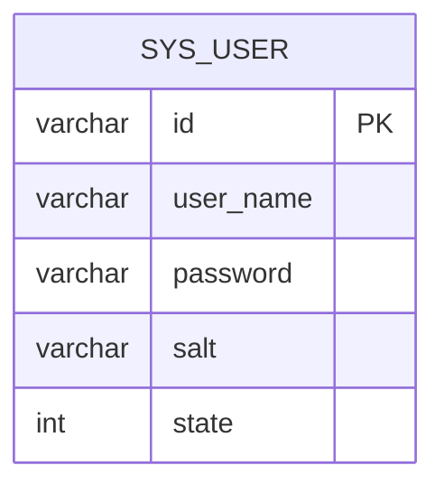

# Plan 003 · 管理端：管理员一键重置用户密码

## Summary

在「用户管理」列表为每个用户提供「重置密码」行操作：`sa` 二次确认后，把该用户密码重置为系统默认初始密码 `123456`，只改密码、不动其它字段。覆盖 PRD 003 的 R1–R6 / AE1–AE5。

## Problem Frame

员工忘密码当前只能改库，重且不可审计。需在管理端提供受控、可审计的一键重置入口，权限收敛到 `sa`。

## 概要设计

- **后端**：在 `SysUserController` 增 `POST /exam/api/sys/user/reset-pwd`（`@RequiresRoles("sa")`），入参 `{ id }`；`SysUserService` 增 `resetPwd(id)`，复用 `PassHandler` 按默认密码 + 该用户 salt 重新加密后只更新 `password` 字段。
- **前端**：`src/views/sys/user/index.vue` 行操作「重置密码」加 `v-permission="['sa']"`，点击用 `this.$confirm` 显示「姓名（账号）」二次确认，确认后调 `src/api/sys/user/user.js` 的 `resetPwd(id)`，成功 `this.$message.success`。
- **关键决策**：重置值固定 `123456`（与新建用户一致）；不强制改密、不批量（见 PRD 非目标）。

## 数据 ER 模型

**无新增表 / 字段**，复用现有 `sys_user`（含 `password`、`salt`）。仅 UPDATE `password`，无 schema 变更。

## DB 迁移

无（不涉及建表 / 加字段 / 索引）。

## Requirements 映射

| 需求 | 实现单元 | 验收 |
| --- | --- | --- |
| R1 行内入口 | U2 | AE1 |
| R2 仅 sa | U1（接口鉴权）+ U2（按钮 v-permission） | AE1 |
| R3 二次确认显账号 | U2 | AE2 |
| R4 重置为 123456 | U1 | AE3 |
| R5 成功/失败提示 | U1（错误码）+ U2（提示） | AE4 |
| R6 只改密码 | U1 | AE5 |

## Implementation Units

### U1 · 后端重置接口
- **Files**：`exam-api/.../modules/sys/user/SysUserController.java`（加 `/reset-pwd`）、`.../service/SysUserService.java` + `service/impl/SysUserServiceImpl.java`（加 `resetPwd`）。
- **Dependencies**：无。
- **Patterns to follow**：参照同类 `/save`、`/delete` 端点与 `BaseController.success()` 响应；加密参照新建用户处 `PassHandler` 用法。
- **详细设计**：`resetPwd(String id)`：`getById` 取用户，不存在 `throw new ServiceException(ApiError.ERROR_xxx)`（「用户不存在」，按域续编错误码）；`PassHandler.encrypt("123456", user.getSalt())` 生成新 `password`；`update` 仅 set `password`，不触碰角色/部门/状态。方法加 `@Transactional(rollbackFor = Exception.class)`。Controller 方法 `@RequiresRoles("sa")`。
- **覆盖需求**：R2、R4、R5、R6。
- **Test scenarios**：AE3（默认密码可登录）、AE4（不存在用户报明确错误）、AE5（角色/部门/状态不变）。

### U2 · 前端按钮 + 二次确认
- **Files**：`exam-vue/src/api/sys/user/user.js`（加 `resetPwd`）、`exam-vue/src/views/sys/user/index.vue`（行操作「重置密码」）。
- **Dependencies**：U1（接口就绪后联调）。
- **Patterns to follow**：行操作列既有「编辑/禁用」写法；请求走 `@/utils/request` 的 `post`；权限用 `v-permission`。
- **原型页面**：`docs/engineering/prototype/sys-user.html`（UI 验收基线，以原型为准：行内「重置密码」+ 显示「姓名（账号）」的二次确认弹窗）。
- **详细设计**：按钮 `v-permission="['sa']"`；点击 `this.$confirm('确定将用户 X（account）的密码重置为默认初始密码 123456 吗？', '重置密码', { type: 'warning' })` → `resetPwd(row.id)` → 成功 `this.$message.success('已重置')`，失败由 `request.js` 拦截器统一提示。
- **覆盖需求**：R1、R2、R3。
- **Test scenarios**：AE1（sa 可见、teacher 不可见）、AE2（确认弹窗含账号、取消不变更）。

## 后续（按 workflow.md）

开发 `/ce-work` → 评审 `/code-review` → 测试 `/verify`、`/ce-test-browser`（对照 AE1–AE5 与 sys-user.html）→ 合并 `/ce-commit-push-pr`，完成后本 plan `status: done`。
