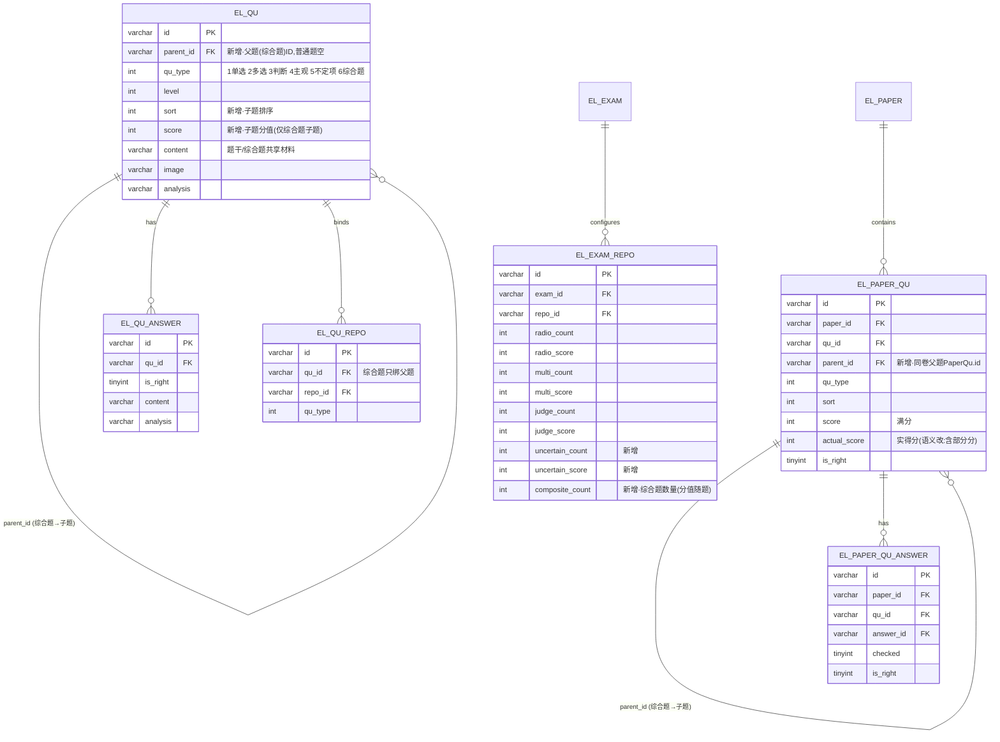

# 004 综合题与不定项题型 · Plan

## Summary

在试题管理新增两种题型并打通「录题 → 组卷 → 作答 → 自动判分 → 成绩/解析」：

1. **不定项（`qu_type=5`）**——客观题，正确答案 1 个或多个，采用**固定半分制**判分。
2. **综合题（`qu_type=6`）**——容器题，含 1 段共享材料 + **恰好 5 个子题**；子题题型 ∈ {单选,多选,判断,不定项}，禁止嵌套综合题。

核心技术取向：**复用现有 `el_qu`/`el_qu_answer`，用「父题 + 子题」关系承载综合题，不建新表**；试卷内把综合题**拍平**为「父行 + 5 个子行」存入 `el_paper_qu`，使每个子题沿用既有的按题型判分路径。判分模型由「非对即错」升级为「按题型算实得分」，并修正客观分汇总口径。

## Problem Frame

承接 PRD 004 的目标/非目标。约束要点：
- 不得改变现有单选/多选/判断/主观题的录入与判分行为（PRD §6 兼容性）。
- 不定项「固定半分制」要求判分能算出**部分分**，而现有 `actual_score` 是「建卷即满分、`is_right=true` 才计入」（`PaperQuMapper.sumObjective` 含 `is_right=true AND qu_type<4`），必须升级（PRD §6 判分模型一致性）。
- 综合题删除须级联删子题；子题不可脱离父题（PRD §6 数据完整性）。
- 鉴权沿用 `@RequiresRoles("sa")`，不引入新依赖（PRD §6）。

## 概要设计

### 架构与模块
- **后端 `exam-api`**：
  - `modules/qu`（题目）——题型枚举、实体、DTO、录题保存/校验/查询/删除。
  - `modules/exam`（考试/组卷 `ExamRepo`）——组卷规则新增不定项/综合题配置。
  - `modules/paper`（试卷/判分）——组卷抽题、判分、客观分汇总、答题/结果数据组装。
- **前端 `exam-vue`**：试题列表/录题表单、综合题录入页（新）、组卷规则表、学员答题页、阅卷/结果页。
- **DB**：见「数据 ER 模型」「DB 迁移」。无新表，仅加列。

### 技术选型与关键决策
1. **综合题用父子题建模、复用 `el_qu`**（备选：新建 `el_qu_composite`+`el_qu_sub` 双表）。选父子复用：子题与普通题字段一致、判分/选项逻辑可直接复用，改动面最小；代价是 `el_qu` 需加 `parent_id/sort/score` 三列并在列表查询里默认隐藏子题。
2. **试卷内把综合题拍平为父行+子行存 `el_paper_qu`**（备选：综合题作为单行内嵌 5 子题的 JSON）。选拍平：每个子行就是一道标准题，`fillAnswer`/答案表/错题本全部复用；父行只承载材料与分组（`qu_type=6`，不参与判分求和）。
3. **题型编码**：`UNCERTAIN=5`、`COMPOSITE=6`（`4` 已是主观题）。因 `sumObjective` 原以 `qu_type<4` 判定客观题，会漏掉不定项=5，故**口径改为按客观叶子题型枚举** `qu_type IN (1,2,3,5)` 直接对 `actual_score` 求和（去掉 `is_right=true`）。
4. **`actual_score` 语义统一为「实得分」**：`processPaperQu` 初始置 0，`fillAnswer` 按题型算出实得分写回。对单选/多选/判断结果不变（对=满分、错=0），对不定项实现半分；综合题父行不计分（其分由 5 子行分别计入）。
5. **不定项「固定半分制」**：见 U5 详细设计；半分 `floor(score/2)`、单题最低 0。
6. **综合题分值随题**：子题各自带 `score`，综合题父题分值 = Σ子题 `score`；组卷只配「综合题数量」，不配分值。

### 接口清单（全部 `POST`，沿用既有路径，无新增端点）
| 接口 | 变更 | 覆盖 |
| --- | --- | --- |
| `/exam/api/qu/qu/save` | `QuDetailDTO` 增 `subQuList`/`score`；服务端按题型分流（不定项校验、综合题校验 5 子题+落父子） | R1,R2,R3,R4,R5,R6 |
| `/exam/api/qu/qu/detail` | 综合题回填 `subQuList`（含各子题选项与分值） | R3,R6,R7 |
| `/exam/api/qu/qu/delete` | 删综合题级联删 5 子题及其选项/题库绑定 | R7 |
| `/exam/api/qu/qu/paging` | 题型筛选支持 5/6；列表默认仅顶层题（`parent_id is null`） | R1,R7 |
| `/exam/api/exam/exam/save`（组卷段） | `ExamRepoDTO` 增 `uncertainCount/uncertainScore/compositeCount` | R8 |
| `/exam/api/paper/paper/edit`（答题/交卷链路：`createPaper`/`fillAnswer`/`handExam`/`paperDetail`/`paperResult`） | 抽题、判分、汇总、答题与结果数据按新题型扩展 | R9,R10,R11,R12,R13 |

### 非功能约束承接（PRD §6 → 设计手段）
- **兼容性**：题型 1/2/3/4 代码分支保持原样；新增逻辑只在 `quType==5/6` 与 `composite_count/uncertain_count>0` 分支触发；`sumObjective` 新口径对旧卷（无 5/6）结果等价（旧卷 `qu_type IN(1,2,3)`，去掉 `is_right=true` 后因 `actual_score` 改为实得分而结果不变——见 U5 验证）。
- **判分模型一致性**：`actual_score`=实得分、`sumObjective` 直接求和；判分纯函数化、同卷重复判分确定。
- **数据完整性**：`delete` 级联（U2）；组卷与作答均按 `parent_id` 成组；`el_qu` 列表默认隐藏子题。
- **权限**：录题/组卷沿用 `@RequiresRoles("sa")`；答题链路沿用现有。
- **回滚**：迁移脚本仅加列、幂等；附 ROLLBACK 注释。

### 风险与回滚
- **R1 `actual_score` 语义变更**影响所有客观题汇总——最高风险。缓解：U5 保留单选/多选/判断判定逻辑不变，仅把「对→满分/错→0」改为写入 `actual_score`，并用旧卷回归（AE 之外加一条等价性验证）。
- **R2 组卷父子链接**：综合题父行 `id` 必须先于子行生成并被子行 `parent_id` 引用。U4 在内存预生成雪花 ID 再批量落库。
- **R3 错题本**：`handExam` 遍历须跳过综合题父行（`qu_type=6`），仅对错的子题/普通题入本。
- 回滚：执行迁移脚本文末 ROLLBACK 段 + 代码回退；新题型数据将丢失。

## 数据 ER 模型


> ER 是逻辑视图，与下面 DB 迁移逐字段一致。

## DB 迁移

落点 [`docs/ops/install/migration-2026-综合题与不定项.sql`](../../ops/install/migration-2026-综合题与不定项.sql)（MySQL 5.7/8.x，幂等加列、可重复执行、附 ROLLBACK）：
- `el_qu` +`parent_id`(varchar64,null)、+`sort`(int,0)、+`score`(int,0)、+索引 `idx_qu_parent`。
- `el_exam_repo` +`uncertain_count`、+`uncertain_score`、+`composite_count`（int，默认 0）。
- `el_paper_qu` +`parent_id`(varchar64,null)。
- 题型编码与 `sumObjective` 口径无 DDL，由代码实现（U1/U5）。

## Requirements 映射 + 覆盖矩阵

| 需求 | 实现单元 | 验收 |
| --- | --- | --- |
| R1 不定项题型 | U1, U2, U3, U7 | AE1 |
| R2 不定项录入校验 | U2, U7 | AE2 |
| R3 综合题(材料+5子题) | U1, U2, U8 | AE3 |
| R4 子题恰好5 | U2, U8 | AE4 |
| R5 子题类型四选一禁嵌套 | U1, U2, U8 | AE5 |
| R6 子题独立录入+分值 | U1, U2, U8 | AE6 |
| R7 列表筛选/删除级联 | U2, U3, U7 | AE7 |
| R8 组卷综合题数量 | U1, U4, U9 | AE8 |
| R9 考生作答综合题 | U6, U10 | AE9 |
| R10 不定项半分制判分 | U5 | AE10 |
| R11 综合题子题汇总 | U4, U5, U6 | AE11 |
| R12 客观自动判分计入总分 | U5 | AE12 |
| R13 解析对/错/部分对+实得分 | U6, U11 | AE13 |

> 每条 R 均落到 ≥1 个 U 且被 ≥1 条 AE 验证，无空格。

## Implementation Units

### U1 题型枚举与数据模型
- **Files**：`modules/qu/enums/QuType.java`、`modules/qu/entity/Qu.java`、`modules/qu/dto/QuDTO.java`、`modules/qu/dto/ext/QuDetailDTO.java`、`modules/exam/entity/ExamRepo.java`、`modules/exam/dto/ExamRepoDTO.java`、`modules/exam/dto/ext/ExamRepoExtDTO.java`、`modules/paper/entity/PaperQu.java`、`modules/paper/dto/PaperQuDTO.java`；migration sql（已建）。
- **Dependencies**：无（最先做）。
- **Patterns to follow**：枚举接口常量式（现 `QuType` 1/2/3）；实体 `@TableField` 下划线列名；DTO 用 lombok `@Data`。
- **详细设计**：
  - `QuType` 增 `Integer UNCERTAIN = 5; Integer COMPOSITE = 6;`。
  - `Qu` 增 `private String parentId; private Integer sort; private Integer score;`（`@TableField("parent_id")` 等）。
  - `QuDTO` 增 `parentId/sort/score`；`QuDetailDTO` 增 `private List<QuDetailDTO> subQuList;`（综合题子题，含各自 answerList 与 score）。
  - `ExamRepo`/`ExamRepoDTO`/`ExamRepoExtDTO` 增 `uncertainCount/uncertainScore/compositeCount`。
  - `PaperQu`/`PaperQuDTO` 增 `private String parentId;`。
- **覆盖需求**：R1,R3,R5,R6,R8（基础）。
- **Test scenarios**：编译通过 + 字段读写映射正确（随 U2/U4 验）。

### U2 录题保存 / 校验 / 详情 / 删除
- **Files**：`modules/qu/service/impl/QuServiceImpl.java`、`modules/qu/service/QuService.java`、`modules/qu/service/impl/QuAnswerServiceImpl.java`（如需按子题查选项）、`modules/qu/controller/QuController.java`（路径不变，复用 `/save /detail /delete`）。
- **Dependencies**：U1。
- **Patterns to follow**：现有 `save()` + `checkData()` + `detail()` + `delete()`；`@Transactional(rollbackFor=Exception.class)`；`ServiceException(1, msg)`；`IdWorker.getIdStr()`。
- **详细设计**：
  - `save(QuDetailDTO)`：按 `quType` 分流——
    - 1/2/3/5（普通题，含不定项）：走原逻辑（`checkData` + 存 Qu + `quAnswerService.saveAll` + `quRepoService.saveAll`）。
    - 6（综合题）：`checkComposite`（见下）→ 存父 Qu（`quType=6`，`content`=共享材料，无选项）→ 父绑题库 `quRepoService.saveAll(parentId,6,repoIds)` → 遍历 `subQuList`：每个子题 `Qu`（`parentId`=父id、`sort`=序、`score`=子题分值、`quType`=子题型）+ `quAnswerService.saveAll(subId, sub.answerList)`；子题**不**单独绑题库。编辑场景：先按 `parent_id` 清旧子题及其选项再重建（简单可靠）。
  - `checkData` 扩展：不定项（5）复用现有「≥1 正确项」规则（现逻辑只对 RADIO 限制 1 个正确项，不定项天然通过，无需额外分支）。
  - `checkComposite(QuDetailDTO)`：`subQuList.size()==5` 否则报「综合题必须包含 5 个子题」；每个子题 `quType ∈ {1,2,3,5}` 否则报「子题不能为综合题/题型非法」；`score>0`；逐子题调 `checkData`（复用单题校验，如单选恰 1 正确项）。
  - `detail(id)`：若 `quType==6`，按 `parent_id=id ORDER BY sort` 取子题并各自填 answerList，set 到 `subQuList`。
  - `delete(ids)`：对综合题 id，先查其子题 id 一并并入删除集合（删 Qu + el_qu_answer + el_qu_repo）。
- **覆盖需求**：R1,R2,R3,R4,R5,R6,R7。
- **Test scenarios**：AE2（不定项 0 正确/选项<2 被拒）、AE4（子题 4/6 个被拒、5 个通过）、AE5（子题=综合题被拒）、AE6（单选 2 正确被拒、判断两项、不定项 0 正确被拒、子题分值各存）、AE7（删综合题级联删 5 子题）。

### U3 列表筛选与查询（默认隐藏子题）
- **Files**：`modules/qu/mapper/QuMapper.java` + `resources/mapper/qu/QuMapper.xml`（`paging`/`listForExport`）、`modules/qu/dto/request/QuQueryReqDTO.java`。
- **Dependencies**：U1。
- **Patterns to follow**：现有 `paging` 动态 SQL 与 `QuQueryReqDTO` 条件拼装。
- **详细设计**：`paging` WHERE 增 `AND parent_id IS NULL`（列表只显顶层题，子题不独立出现）；题型筛选透传 `quType`（支持 5/6）。导出 `listForExport` 同样仅顶层；综合题导出/导入模板说明本期按非目标（PRD §11），列表标注即可。
- **覆盖需求**：R7,R1。
- **Test scenarios**：AE1（按不定项筛选）、AE7（按综合题筛选；子题不出现在列表）。

### U4 组卷抽题扩展（含综合题拍平 + actual_score 归零）
- **Files**：`modules/paper/service/impl/PaperServiceImpl.java`（`generateByRepo`/`processPaperQu`/`savePaperQu`）、`modules/exam/service/impl/ExamRepoServiceImpl.java` + `resources/mapper/exam/ExamRepoMapper.xml`（读写新列）、`modules/exam/service/impl/ExamServiceImpl.java`（保存组卷规则）。
- **Dependencies**：U1。
- **Patterns to follow**：现 `generateByRepo` 按题型 `listByRandom` + `processPaperQu`；`savePaperQu` 批量建 `PaperQu`+`PaperQuAnswer`。
- **详细设计**：
  - `processPaperQu`：**`actualScore` 一律初始化为 0**（不再预置满分）；新增 `UNCERTAIN` 分支 `score=repo.uncertainScore`。
  - `generateByRepo`：增不定项分支（`item.getUncertainCount()>0` → `listByRandom(repoId, UNCERTAIN, …)`）；增综合题分支（`item.getCompositeCount()>0`）：
    1. `listByRandom(repoId, COMPOSITE, excludes, compositeCount)` 取父题；
    2. 每个父题：`String parentPaperQuId = IdWorker.getIdStr()`；建父 `PaperQu`（`id=parentPaperQuId`,`quType=6`,`score=Σ子题score`,`actualScore=0`,`parentId=null`，无选项）；
    3. 取子题 `quService.listByParent(parentQuId)`（按 sort），每个子题建 `PaperQu`（`quType`=子题型,`score`=子题score,`actualScore=0`,`parentId=parentPaperQuId`）；
    4. 父+子一起加入 `quList`，父题 quId 计入 `excludes`。
  - `savePaperQu`：父行无选项（`listAnswerByRandom` 返回空，自然跳过）；保留预生成的 `id`（综合题需要），普通题仍可由方法内赋 id。微调：若 `item.getId()` 已设则不覆盖。
  - `ExamRepoMapper.xml` 读写 `uncertain_*`/`composite_count`。
- **覆盖需求**：R8,R11（分值随题）。
- **Test scenarios**：AE8（组卷设综合题数量 N → 试卷含 N 个综合题、每个带 5 子题）；AE11 前置（子题各带分值进卷）。

### U5 判分模型升级（不定项半分制 + 汇总口径）
- **Files**：`modules/paper/service/impl/PaperServiceImpl.java`（`fillAnswer`/`handExam`）、`resources/mapper/paper/PaperQuMapper.xml`（`sumObjective`）。
- **Dependencies**：U1，U4。
- **Patterns to follow**：现 `fillAnswer` 遍历 `PaperQuAnswer` 比对 `checked` vs `isRight`；`handExam` 调 `sumObjective`。
- **详细设计**：
  - `fillAnswer`：先取本题 `PaperQu`（拿 `quType`、`score`），遍历选项写回 `checked`，统计：`hasWrongChecked`（`checked && !isRight`）、`allRightChecked`（所有 `isRight` 均 `checked`）、`anyRightChecked`。按题型算 `earned` 与 `isRight`：
    - 1/2/3：`right = !hasWrongChecked && allRightChecked`；`earned = right ? score : 0`（结果与现状一致）。
    - 5 不定项（固定半分制）：`hasWrongChecked → earned=0,right=false`；否则 `allRightChecked → earned=score,right=true`；否则（漏选无错选，`anyRightChecked`）`earned=floor(score/2),right=false`；全未选 `earned=0`。
    - `actualScore=earned`；写回 `PaperQu(isRight, actualScore, answered=true, answer)`。
  - `sumObjective`（XML）：改为
    ```sql
    SELECT IFNULL(SUM(actual_score),0) FROM el_paper_qu
    WHERE paper_id=#{paperId} AND qu_type IN (1,2,3,5)
    ```
    （去掉 `is_right=true`；不定项=5 计入；综合题父=6、主观=4 不计入。综合题客观子题为 1/2/3/5，自然计入。）
  - `handExam`：错题本遍历跳过 `qu_type==6`（综合题父）；其余「非满分」逻辑可保留（按 `isRight` 判定是否入本；不定项部分对 `isRight=false` 会入错题本，符合预期）。
- **覆盖需求**：R10,R11,R12。
- **Test scenarios**：AE10（满分 10、正确{A,C}：选{A,C}=10、选{A}=5、选{A,B}=0、选{A,C,D}=0）；AE11（5 子题 2/3/2/1/2 分、得 2/0/1/1/2 → 综合题 6 分）；AE12（含不定项与综合题客观子题计入客观总分）；**等价性回归**：纯 1/2/3 旧卷总分与改造前一致。

### U6 答题与结果数据组装
- **Files**：`modules/paper/service/impl/PaperServiceImpl.java`（`paperDetail`/`paperResult`/`findQuDetail`）、`modules/paper/dto/response/ExamDetailRespDTO.java`、`modules/paper/dto/ext/PaperQuDetailDTO.java`、`resources/mapper/paper/PaperQuMapper.xml`（`listByPaper`/`listForPaperResult` 带出 `parent_id`/`score`/`qu_type`）。
- **Dependencies**：U1，U5。
- **Patterns to follow**：现 `paperDetail` 按题型分 `radioList/multiList/judgeList`；`paperResult` 走 `listForPaperResult` 扁平列表。
- **详细设计**：
  - `ExamDetailRespDTO` 增 `uncertainList`（同其它列表）与 `compositeList`（每项=父 `PaperQuDTO` + `subList`）。`paperDetail` 分组：`parent_id` 非空的子题挂到对应父项的 `subList`，父题（`qu_type=6`）进 `compositeList`，不定项进 `uncertainList`，其余照旧。
  - `paperResult`：`PaperQuDetailDTO` 增 `parentId/score/quType`；前端据 `parentId` 成组、用 `actualScore/score` 显示「对/错/部分对+实得分」。
- **覆盖需求**：R9,R11,R13。
- **Test scenarios**：AE9（综合题作答数据含材料+5 子题）、AE13（结果含不定项部分分、综合题子题与小计）。

### U7 前端·不定项录题 + 列表
- **Files**：`exam-vue/src/views/qu/qu/form.vue`、`exam-vue/src/views/qu/qu/index.vue`、`exam-vue/src/views/qu/qu/view.vue`、`exam-vue/src/filters/index.js`、`exam-vue/src/api/qu/qu.js`。
- **Dependencies**：U2,U3（接口）。
- **Patterns to follow**：现 `form.vue` 的 `quTypes` 与 `handleTypeChange`；`quTypeFilter`。
- **原型页面**：`docs/engineering/prototype/qu.html`、`qu-form.html`（UI 以原型为准）。
- **详细设计**：`quTypes` 加 `{value:5,label:'不定项'}`；不定项用复选答案、客户端提示半分制；`quTypeFilter` 加 5=不定项、6=综合题；`index.vue` 题型筛选加 5/6、列表加「添加综合题」入口（跳转综合题录入路由）。
- **覆盖需求**：R1,R2,R7。
- **Test scenarios**：AE1、AE2、AE7（筛选）。

### U8 前端·综合题录入页（新）
- **Files**：`exam-vue/src/views/qu/qu/form-composite.vue`（新）+ 路由注册 `exam-vue/src/router`；复用 `exam-vue/src/api/qu/qu.js`。
- **Dependencies**：U2（`/save` 接 `subQuList`）。
- **Patterns to follow**：`form.vue` 的选项编辑与上传组件；Element-UI 表单校验。
- **原型页面**：`docs/engineering/prototype/qu-form-composite.html`（UI 与交互以原型为准：共享材料+材料图片、5 个固定子题、子题题型四选一无综合题、各带分值、合计=Σ子题）。
- **详细设计**：固定 5 个子题块，子题题型 radio ∈ {单选,多选,判断,不定项}；提交组装 `QuDetailDTO{quType:6, content:材料, repoIds, subQuList:[{quType,content,score,analysis,answerList}]}`；保存前校验 5 子题齐全、各子题答案合法。
- **覆盖需求**：R3,R4,R5,R6。
- **Test scenarios**：AE3,AE4,AE5,AE6。

### U9 前端·组卷规则
- **Files**：`exam-vue/src/views/exam/exam/form.vue`。
- **Dependencies**：U4（`ExamRepoDTO` 新字段）。
- **Patterns to follow**：现组卷规则表的「数量/分值」录入与合计计算。
- **原型页面**：`docs/engineering/prototype/exam-form.html`（组卷规则加「不定项（数量/分值）」「综合题（数量）」列与整体抽取说明）。
- **详细设计**：每题库行增 `uncertainCount/uncertainScore/compositeCount` 录入；综合题只录数量（分值随题，合计提示注明）；合计分值/题数计算纳入不定项与综合题（综合题分值在前端按所选题预估或仅提示「随题」）。
- **覆盖需求**：R8。
- **Test scenarios**：AE8。

### U10 前端·学员答题
- **Files**：学员答题页（`exam-vue/src/views/...` 在线答题组件，对应原型 `exam-taking.html`）。
- **Dependencies**：U6（`paperDetail` 增 `uncertainList`/`compositeList`）。
- **Patterns to follow**：现答题页按 `radioList/multiList/judgeList` 渲染、`fillAnswer` 提交。
- **原型页面**：`docs/engineering/prototype/exam-taking.html`（不定项=多选式作答；综合题=共享材料+5 子题逐题作答）。
- **详细设计**：渲染 `uncertainList`（多选交互）；`compositeList` 先展示材料，再逐子题渲染（按子题型用单选/多选/判断/不定项交互），每子题独立调 `fillAnswer`（子题各有 `quId`）。
- **覆盖需求**：R9。
- **Test scenarios**：AE9。

### U11 前端·阅卷/结果
- **Files**：`exam-vue` 试卷详情/结果页（对应原型 `paper-detail.html`、考试结果页）。
- **Dependencies**：U6。
- **Patterns to follow**：现结果页按题展示对/错与解析、主观题人工评分框。
- **原型页面**：`docs/engineering/prototype/paper-detail.html`（不定项「部分对+实得分」、综合题材料+5 子题对/错/部分对+小计）。
- **详细设计**：按 `parentId` 成组渲染综合题；每题用 `actualScore/score` 显示「对/错/部分对」与得分；不定项展示半分制评分说明。
- **覆盖需求**：R13。
- **Test scenarios**：AE13。

## 并行 / 冲突关系
- **U1 必须最先**完成（其余全依赖实体/DTO/枚举）。
- 后端 U2/U3（题目域）与 U4/U5/U6（试卷域）可在 U1 后并行；U5 依赖 U4（抽题产物）、U6 依赖 U5。
- 前端 U7–U11 可在对应后端接口（U2/U4/U6）就绪后并行；UI 一律以 `docs/engineering/prototype/` 对应页为准，偏离需先走 `/spec-change` 改原型。
- 与其它 plan：仅 001（预约考试）也改 `PaperServiceImpl.createPaper`（时间段门禁）与 `ExamRepo`，本特性改其 `generateByRepo`/`processPaperQu` 与 `ExamRepo` 加列，**同文件不同方法/不同列**，合并时注意 `PaperServiceImpl` 与 `ExamRepo*` 的 diff 叠加，无逻辑冲突。
